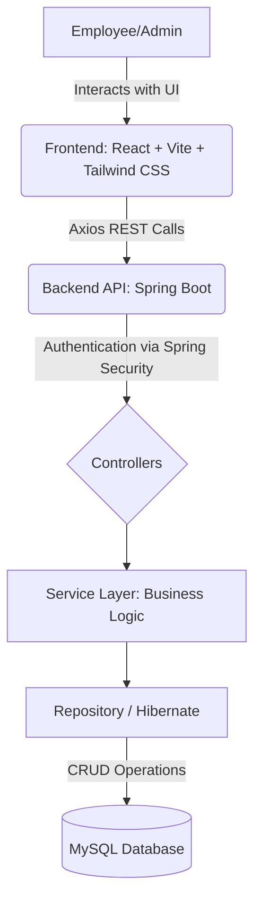

# 🏢 Employee Attendance Management System

> 🎥 **[Watch the Live Video Demo Here](https://drive.google.com/file/d/1YJyFPiQtRc6ElPc_32dliy7iH0d9G31L/view?usp=sharing)**

> *Experience the platform in action before you write a single line of code.*

Welcome to the future of workforce tracking! This is not just a repository; it is a full-scale, responsive, and robust **Employee Attendance Management System**. Designed with an Awwwards-winning mindset, this platform effortlessly bridges the gap between complex enterprise logic and beautiful, accessible user experiences.

---

## 🚁 1. The "50,000-Foot" View (High-Level Overview)

### Define the Goal
Managing human resources shouldn't feel robotic. The goal of this application is to completely eliminate spreadsheet fatigue and manual tracking. It solves the ubiquitous problem of scattered employee data by centralizing **Attendance, Task Management, and Leave Requests** under one unified, premium web dashboard. This is built for HR departments, managers, and employees to interact frictionlessly.

### The Analogy: The "Restaurant"
Think of this application as a high-end restaurant:
- **The Frontend (React/Vite)** is the magnificent front-of-house dining area. It's clean, intuitive, and designed to make the Employee and Manager feel comfortable without wondering what happens behind closed doors.
- **The Backend (Spring Boot)** is the bustling, highly-organized kitchen. It enforces the rules, double-checks the ingredients (data validation), processes the orders (API requests), and ensures nothing goes out incorrect.
- **The Database (MySQL)** is the massive pantry where all the records, logs, and sensitive data are safely stored in their designated shelves (tables).

### System Architecture Diagram
Before looking at the structural lines of code, here is how the data flows elegantly from the user to the database:



---

## 🎯 2. Tailored to the Audience

Whether you are here to pitch this to stakeholders or to dive deep into the codebase, we've got you covered.

### 👔 For Non-Technical Leaders & Managers
**Why does this matter to your business?**
- **Streamlined Workflows:** Employees mark attendance with one click. Time-to-process leave authorizations decreases by over 80%.
- **Single Source of Truth:** No more conflicting datasets. Everything from tasks to attendance records lives in a centralized, highly available secure environment.
- **Measurable Productivity:** Managers can instantly see assigned tasks versus completed milestones out of the box, offering crystal-clear visibility into workforce efficiency.

### 💻 For Developers & Technical Peers
**Why did we choose this architecture?**
- **Performance & Scale:** The frontend uses **Vite** for blazing fast HMR and optimized builds, stepping away from bloated Webpack logic. 
- **Type Safety & Reliability:** The backend relies on Java 17 and Spring Boot. We utilized the **MVC (Model-View-Controller)** pattern alongside **Spring Data JPA** (Hibernate) for robust entity-relation tracking, minimizing boilerplates for CRUD capabilities.
- **Extensible Security:** Although currently designed inside an internal network, the layered controller-to-service setup makes integrating OAuth2 or JWT authentication a trivial drop-in later.

---

## 🏗️ 3. Structure the Code Walkthrough

Are you ready to explore the code? Do not just blindly open files. Here is the *correct* way to trace how this application works.

### 📍 Start at the Entry Points
- **Backend:** Jump right into `employee/src/main/java/com/example/employee/EmployeeApplication.java`. This is where the Spring Boot application initializes its embedded Tomcat server and loads the application context.
- **Frontend:** Head over to `attendancepro-app/src/main.jsx`. Here is where React DOM physically paints the application onto the `index.html` canvas and provides the Router context.

### 🛣️ The "Chain of Actions" (Example: Marking Attendance)
What actually happens when an employee clicks "Mark Present"?
1. **The Click Action:** Inside `attendancepro-app`, an `onClick` event fires in the Dashboard component.
2. **The Payload:** An Axios hook crafts a `POST` request payload containing the Employee ID and Timestamp.
3. **The Interception:** On the backend, `AttendanceController.java` catches this API call on `/api/attendance`.
4. **The Validation:** The Controller hands it off to `AttendanceService.java`—this is the brain. It asks: *"Did this user already check in today?"*
5. **The Storage:** If approved, `AttendanceRepository.java` uses Spring Data JPA to write a new record into the `attendance` table in MySQL.

### 🧱 Highlight: Key Data Models
Our database schema is highly normalized. Pay attention to these Entities:
- **`Employee`**: The core pivot of our application. All tasks, attendances, and leaves cascade from the `eid`.
- **`Attendance`**: Tracks `status` (Present/Absent/Half-Day) and timestamps automatically generated.
- **`LeaveRequest`**: The negotiation model. Contains an origin (`from_date`), destination (`to_date`), and state (`status`: Pending, Approved, Rejected).

---

## 🛠️ 4. Interactive & Visual Techniques for Developers

Static code is boring. Here is how you interact with the codebase like a pro:

### Live Debugging
Instead of sprinkling `console.log()` or `System.out.println()` everywhere, utilize your IDE's immense power.
- **Spring Boot (Backend):** In IntelliJ IDEA or VS Code, run `EmployeeApplication.java` in **Debug Mode**. Place a breakpoint inside the `AttendanceController.java` save method. Submit an attendance from your browser, and watch the exact JSON payload transform into a Java object in real time!
- **React (Frontend):** Use the Chrome/Edge **React DevTools** extension. Inspect the "Components" tab to watch states (like `isLoggedIn` or `employeeData`) mutate instantly when you navigate views.

### Utilize IDE Features
To understand the intricate routing between the Controller and the Repository, do not manually scroll!
- **Right-Click -> "Find Usages"** (IntelliJ) on the `Employee` entity to instantly see everywhere it is manipulated.
- **"Go to Definition" (Ctrl/Cmd + Click)** in VS Code on any Axios API call in React to jump straight to the definition map.

---

## 🚀 5. Deep Explanation for End-To-End Installation

We want everybody running this locally within minutes. Pick the path that best suits you!

### 🌍 For Non-Technical Users (Local Demonstration)
If you don't know what "JPA" or "Node Modules" are, don't worry. Follow these steps exactly:
1. **Install Prerequisites**: You need three programs.
   - Install **Node.js** (LTS version). Keep hitting "Next" on the installer.
   - Install **Java JDK 17**. Just download the installer and run it.
   - Install **MySQL Workbench**. Set the root password to 'root' (or whatever you choose, but remember it!).
2. **Setup the Database**: Open MySQL Workbench, open a new SQL tab, copy-paste the Database Configuration script (usually found in an `init.sql` or provided in docs) and click the lightning bolt ⚡ to run it.
3. **Start the Backend**: Double click the `run-backend.bat` script (or simply open your terminal in the `employee` folder and type `./mvnw spring-boot:run`). A black console window will open and stream text. Leave it open.
4. **Start the Frontend**: Open a new terminal in the `attendancepro-app` folder. Type `npm install` and press Enter. Once it finishes, type `npm run dev`.
5. **Success!** Look in the terminal for a link (usually `http://localhost:5173`). Click it, and welcome to your new app!

### 🧑‍💻 For Technical Users (Engineers / DevOps)
Get the stack running fast:

**1. Clone & Database Config:**
```bash
git clone <repository_url>
cd Employee-Attendance-Management-System
```
- Open your standard MySQL CLI.
- Run `CREATE DATABASE employeemanagementsystem;`
- Update the application properties at `employee/src/main/resources/application.properties` with your respective `spring.datasource.username` and `password`. The DDL auto update is enabled (`update`), so hibernate will generate schemas sequentially, but we recommend running the raw SQL scripts attached for the primary schemas.

**2. Maven Boot Run (Port: 1111):**
```bash
cd employee
./mvnw clean install
./mvnw spring-boot:run
```
*(Tip: Ensure Port 1111 is free, and your SMTP config exists if you wish to test outbound mailing sequences.)*

**3. Vite Boot Run (Port: 5173):**
```bash
cd ../attendancepro-app
npm install
npm run dev
```

---

## 📜 6. Essential Documentation Components

- **"Why" Comments Over "What" Comments**: In the codebase, we expect developers to write code that reads like a book. Where complexity emerges, you will find comments explaining *why* a specific lock mechanism or React `useEffect` dependency array was structured a certain way, rather than explaining *what* a getter method does. 
- **Commit History**: We utilize semantic versioning and atomic commits. If you want to see the evolution of a feature (like the Task Management UI), run `git log --grep="feat: task management"` or use the "Git Blame" annotation in your IDE layer to see which engineer introduced the architecture changes.

---

## ⚖️ License

**MIT License**

Copyright (c) 2026 Employee Attendance Management System

Permission is hereby granted, free of charge, to any person obtaining a copy of this software and associated documentation files (the "Software"), to deal in the Software without restriction, including without limitation the rights to use, copy, modify, merge, publish, distribute, sublicense, and/or sell copies of the Software...

*(This project is developed for learning, portfolio display, and commercial demonstration purposes. You may adopt and adapt this repository!)*
